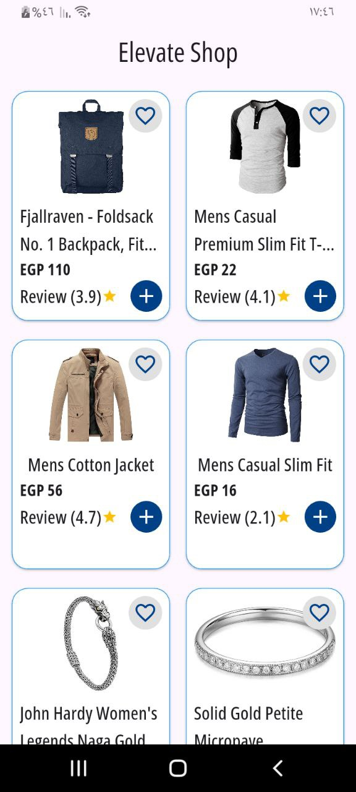
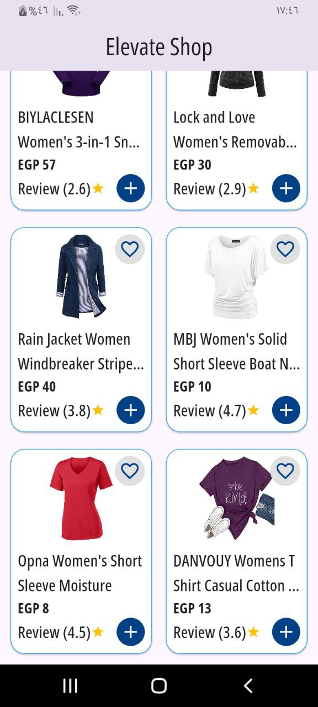

# Elevate Shop
## 📷 **شاشة التطبيق**

هذا المشروع يستخدم Bloc/Cubit لإدارة حالة التطبيق وفصل المنطق عن الواجهة الأمامية، مما يعزز التنظيم والكفاءة. كما يعتمد على Dio لجلب البيانات، CachedNetworkImage للحفاظ على الصور، وShimmer لتحسين تجربة المستخدم أثناء تحميل المحتوى. كذلك، تم اعتماد الخط OpenSans لجعل تصميم التطبيق أكثر جاذبية، مع هيكلة مناسبة للمجلدات لزيادة سهولة الصيانة.

This project utilizes Bloc/Cubit for state management, separating business logic from UI to enhance structure and efficiency. It relies on Dio for data fetching, CachedNetworkImage for image caching, and Shimmer to improve user experience while loading content. Additionally, the OpenSans font was integrated for a more visually appealing design, with proper folder structuring to improve maintainability.
All necessary libraries should be included in the project to ensure proper functionality.

فيما يلي قائمة بجميع المكتبات المستخدمة في هذا المشروع، والتي يجب التأكد من تضمينها في ملف pubspec.yaml:
,
dependencies:
  flutter:
    sdk: flutter

  <!-- # The following adds the Cupertino Icons font to your application.
  # Use with the CupertinoIcons class for iOS style icons. -->
  cupertino_icons: ^1.0.8

  dio: ^5.8.0+1

  bloc: ^9.0.0

  flutter_bloc: ^9.1.1

  cached_network_image: ^3.4.1
  
  shimmer: ^3.0.0

<!-- screenshots\photo_2025-04-21_05-12-16.jpg
screenshots\photo_2025-04-21_05-12-19.jpg -->